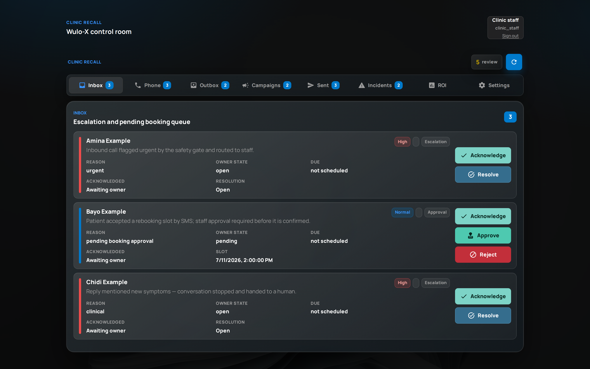
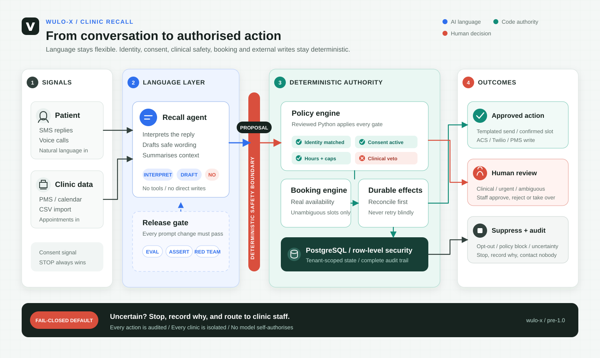
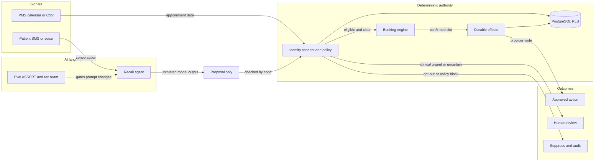

# Wulo-X: Clinic Recall

Wulo-X is an open-source appointment-recovery and follow-up system for clinics. It detects missed or overdue appointments, starts consent-aware SMS outreach, can fall back to a governed voice agent, books only through deterministic application logic, and routes clinical, urgent, complaint, safeguarding, or uncertain content to staff.

> **Project status:** pre-1.0 engineering preview. Wulo-X is not a medical device and must not diagnose, triage, or provide medical advice. Do not use real patient data until you have completed your own clinical-safety, privacy, security, telecoms, and regulatory review.



*The clinic control room (synthetic data): urgent and clinical items are escalated to staff, and rebookings wait for human approval.*

## Core Principles

- AI generates language; deterministic code controls identity, consent, eligibility, booking, money, and external writes.
- Clinical or uncertain content fails closed to a human.
- Tenant isolation is enforced in the application and with PostgreSQL row-level security.
- Prompt changes are versioned and pass evaluation, ASSERT, and red-team gates before release.
- Provider effects use durable state and reconciliation rather than unsafe blind retries.

The boundary between what the model may do and what code decides is documented in [docs/deterministic-safety-boundary.md](docs/deterministic-safety-boundary.md).

## Architecture



The same flow as a diffable diagram:

<!-- mermaid-checked: no \n, no em-dash/en-dash, no {} in labels, subgraphs are id["label"], arrows are -->|"label"|, all subgraphs closed by end, ids unique -->


## Repository Map

| Path | Purpose |
|---|---|
| `apps/artagent/` | FastAPI backend and React frontend inherited from the voice-agent accelerator |
| `apps/cardapi/` | MCP-compatible card API service |
| `src/clinic_recall/` | Tenant-scoped Clinic Recall domain and deterministic workflows |
| `src/recall-agent/`, `src/inbound-assistant/` | Microsoft Foundry hosted-agent definitions and evaluators |
| `voicekit/` | Offline deterministic voice-transport fakes and failure-mode tests |
| `.agentops/`, `assert/`, `agentops*.yaml` | Versioned prompts, synthetic eval data, and safety gates |
| `infra/` | Terraform, Bicep, and PostgreSQL migrations |
| `devops/` | Local tooling, deployment hooks, probes, and governance runners |
| `tests/` | Offline unit, integration-contract, safety, and UI tests |

## Local Setup

Prerequisites:

- Python 3.11-3.13
- [uv](https://docs.astral.sh/uv/)
- Node.js 20+ for the frontend
- Docker only if you want the composed services

Install the Python project and run offline tests:

```bash
git clone https://github.com/Ayo-faks/wulo-x.git
cd wulo-x
uv sync --extra dev
uv run pytest -q
```

Run the standalone voice transport tests:

```bash
cd voicekit
uv sync --extra dev --extra contract
uv run pytest -q
python evals/run_evals.py --repeats 20
```

Run the frontend locally:

```bash
cd apps/artagent/frontend
npm ci
npm run dev
```

The frontend is available at `http://localhost:5173`. A functional backend needs the services configured in `.env`.

## Full Application Configuration

Copy the environment template and replace placeholders with resources you own:

```bash
cp .env.sample .env
```

The full voice workflow is not an offline mock. It requires an Azure subscription and, depending on enabled features, Azure AI Services/OpenAI, Speech, Microsoft Foundry, Azure Communication Services, PostgreSQL, Redis, storage, and either ACS or Twilio telephony. Secrets belong in local environment files or Azure Key Vault and must never be committed.

Start the containerized services after configuring `.env`:

```bash
docker compose --project-directory . -f devops/docker-compose.yml up --build
```

For Azure provisioning and production controls, read [the production bring-up runbook](docs/clinic-recall-production-bring-up-runbook.md). Review every Terraform plan before applying it.

## Agent Safety Gates

The production prompt is [.agentops/prompts/recall-agent.prompt.md](.agentops/prompts/recall-agent.prompt.md). Hosted gates require your own Foundry project, evaluator deployment, GitHub environment variables, and OIDC identity. Azure-backed workflows are manual-dispatch only in the public repository; fork pull requests run the credential-free CI.

```bash
make recall_agent_gate
make inbound_assistant_gate
```

These commands are cloud-backed and may incur cost. Offline tests do not contact patients or providers.

## Contributing and Security

The [roadmap](ROADMAP.md) lists current priorities and three contribution areas that run fully offline; starter tasks are labelled [good first issue](https://github.com/Ayo-faks/wulo-x/issues?q=is%3Aissue+is%3Aopen+label%3A%22good+first+issue%22). See [CONTRIBUTING.md](CONTRIBUTING.md) before opening a pull request. Report vulnerabilities privately as described in [SECURITY.md](SECURITY.md); never include patient data, credentials, call recordings, or production identifiers in an issue.

## License and Attribution

Wulo-X is released under the MIT License. It is derived from the [ART Voice Agent Accelerator](https://github.com/aiappsgbbfactory/art-voice-agent-accelerator), originally created by Pablo Salvador Lopez and Jin Lee. See [LICENSE](LICENSE) and [NOTICE](NOTICE) for attribution.
