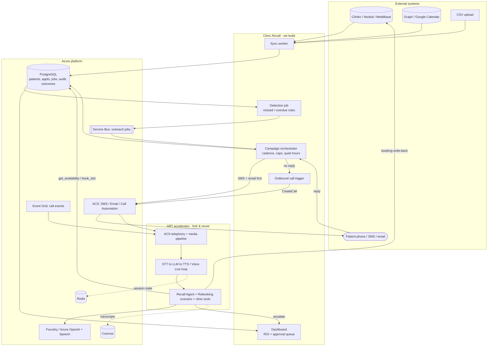
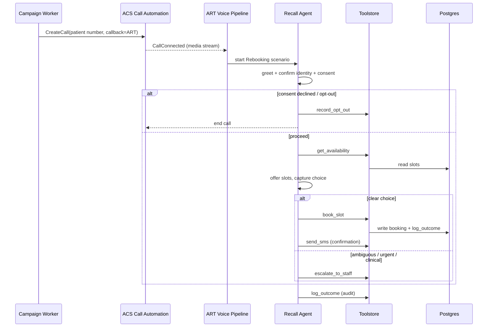

# Clinic Recall - Integration & Build Plan (Fork ART -> Add Clinic Recall)

**Working product name:** Clinic Recall (provisional codename)
**Status:** Draft v0.1
**Date:** 2026-06-26
**Source PRD:** `clinic-recall-mvp-prd.md`
**Source BRD:** `clinic-recall-mvp-brd.md`
**Document type:** Technical design / solution architecture (the "HOW" layer)

---

## 0. How this differs from the BRD and PRD

| Doc | Question it answers | Reader | Stable against |
|---|---|---|---|
| BRD | Why build it (problem, market, ROI, pricing) | Founder, commercial | Tech choices |
| PRD | What it must do (personas, user stories, functional reqs) | Product, design, eng | Tech choices |
| **This plan** | **How we build it** (fork ART, tools/files to add, infra delta, sequence) | **Engineers** | Changes if stack changes |

The BRD/PRD are solution-agnostic. This document is solution-specific: it names repositories, directories, SDK calls, and a build order. It implements the PRD; it does not redefine scope.

---

## 1. Strategy

Fork **`Azure-Samples/art-voice-agent-accelerator`** (ART) as the voice spine. ART already provides ACS telephony, the STT->LLM->TTS / Voice Live inference loop, a FastAPI/WebSockets media pipeline, an agent/tool/scenario registry, and Terraform+Bicep infra deployed via `azd up`. We add clinic-specific tools, one agent, one call scenario, a few background services, and an ROI dashboard.

> We do not rebuild the voice plumbing. We add clinic logic on top of ART's extension points and wire an outbound trigger + data/orchestration services around it.

### 1.1 System Architecture (one view)



Legend: solid arrows = primary flow; dotted = state/logging. **we build** = Clinic Recall code; **fork & reuse** = ART; **Azure platform** = managed services (ART already provisions the voice stack; we add Postgres, Service Bus, Email, Event Grid, jobs).

---

## 2. Reuse vs Build (component level)

| Component | Decision | Source |
|---|---|---|
| Telephony + media streaming (ACS) | Reuse | ART `src/` + backend `voice/` |
| STT->LLM->TTS / Voice Live loop | Reuse | ART `voice/` orchestrators |
| Agent/tool/scenario registry | Reuse + extend | ART `registries/` |
| Infra (Terraform/Bicep, `azd up`) | Reuse + extend | ART `infra/` |
| Demo web client | Reuse as dashboard base | ART `apps/artagent/frontend/` |
| Outbound call initiation | **Build** (ACS Call Automation `CreateCall`) | New endpoint + worker |
| PMS/calendar sync | **Build** | New service |
| Candidate detection rules | **Build** | New job |
| Campaign cadence (SMS-first -> voice) | **Build** | New worker |
| Deterministic booking/write-back | **Build** (ART tool) | New toolstore tool |
| Consent / opt-out / audit | **Build** | New service + DB |
| ROI dashboard | **Build** (extend ART frontend or BYO copilot) | New UI |
| Orchestration/HITL patterns | Reference | `microsoft/Multi-Agent-Custom-Automation-Engine`, `Prior-Authorization-Multi-Agent` |

---

## 3. ART Extension Points

ART's relevant layout (verified):

```
apps/artagent/backend/
  registries/
    agentstore/      # YAML agent configs + Jinja2 prompts   <- add Recall Agent
    scenariostore/   # multi-agent orchestration flows        <- add Rebooking flow
    toolstore/       # pluggable business tools (Python)       <- add clinic tools
  voice/             # SpeechCascade / VoiceLive orchestrators (reuse as-is)
apps/artagent/frontend/   # Vite + React client (reuse -> dashboard)
src/                       # ACS, Speech, AOAI, Redis, Cosmos, VAD (reuse)
infra/                     # Terraform + Bicep (extend)
azure.yaml                 # ACS_STREAMING_MODE = MEDIA | VOICE_LIVE
```

### 3.1 Tools to add (`registries/toolstore/`)

| Tool | Signature (indicative) | Deterministic? | Notes |
|---|---|---|---|
| `get_availability` | `(clinic_id, clinician_id?, window) -> [slots]` | Yes | Reads PMS/calendar; no LLM judgement |
| `book_slot` | `(patient_id, slot_id) -> booking_result` | Yes | Writes back to PMS or creates staff task; idempotent |
| `reschedule` | `(appointment_id, slot_id) -> result` | Yes | Same guard rails as `book_slot` |
| `send_sms` | `(patient_id, template, vars) -> msg_id` | Yes | ACS SMS; respects opt-out + caps |
| `send_email` | `(patient_id, template, vars) -> msg_id` | Yes | ACS Email |
| `escalate_to_staff` | `(patient_id, reason, context) -> ticket_id` | Yes | Creates approval/escalation item; highest priority for urgent/clinical |
| `record_opt_out` | `(patient_id, channel) -> ack` | Yes | Suppress immediately + permanently |
| `log_outcome` | `(job_id, outcome, revenue?) -> ack` | Yes | Writes audit + ROI telemetry |

The LLM may *call* these tools, but each tool enforces business rules itself. The model cannot self-authorise a booking outside `get_availability` + `book_slot`.

### 3.2 Agent to add (`registries/agentstore/`)

- **Recall Agent** - one YAML config + Jinja2 prompt.
- Scope hard-limited to: confirm identity/consent, state reason for contact, offer/confirm slots, capture feedback.
- Guardrails baked into the prompt + a safe-stop tool: no diagnosis, no medical advice; any clinical/urgent/distress signal -> `escalate_to_staff` and end.

### 3.3 Scenario to add (`registries/scenariostore/`)

**Rebooking call flow:**



### 3.4 Prompt-as-code + governance (AgentOps)

The Recall Agent's instructions (its `agentstore` prompt) are managed as **prompt-as-code** and gated by an automated eval + safety pipeline. This is wired in this project:

| Concern | Where |
|---|---|
| Agent prompt (source of truth) | `.agentops/prompts/recall-agent.prompt.md` |
| Eval config (rubric + thresholds) | `agentops.yaml` (dims `completes_rebooking`, `safe_clinical_boundary`, `honours_opt_out`; `smoke-core >= 0.8`) |
| azd eval recipe + custom evaluator | `src/recall-agent/eval.yaml` + `evaluators/smoke-core/rubric_dimensions.json` |
| Safety gates | ASSERT (`assert/eval_config.yaml`, `fail_on_violations: true`) + Foundry Red Team |
| CI | `agentops-pr.yml` (PR gate), `agentops-deploy-dev.yml` (deploy), `agentops-scheduled.yml` (nightly safety) |

**Rule:** the `scenariostore` flow above is the runtime; the prompt that drives it ships only through this gate. A change that regresses `safe_clinical_boundary`, fails ASSERT, or exceeds the Red Team attack-success threshold blocks the merge. This is how "no medical advice / always escalate" (Section 3.2) is enforced automatically rather than by hope.

---

## 4. New Services Around ART

| Service | Responsibility | Tech |
|---|---|---|
| Sync worker | PMS/calendar/CSV -> normalized Postgres | Container Apps Job / Function |
| Detection job | Apply candidate rules (missed/overdue/due) -> queue | Container Apps Job |
| Campaign orchestrator | Cadence: SMS-first, voice fallback, caps, quiet hours; enqueue outbound jobs | Worker + Service Bus |
| Outbound trigger | `CreateCall` into ART pipeline on no-reply | Endpoint using ACS Call Automation |
| Dashboard | Approval/escalation queue + ROI | Extend ART frontend or `Build-your-own-copilot` |
| Datastore | patients, appointments, jobs, outcomes, audit | PostgreSQL |

---

## 5. The Critical Wiring: Outbound Call -> ART

ART is built around a media pipeline; the key integration is initiating an **outbound** call that lands in that same pipeline:

1. Campaign worker decides a patient needs a voice call (no SMS reply within window).
2. Worker calls **ACS Call Automation `CreateCall`** with the patient number and the callback URI pointing at ART's call-event webhook (mirror the inbound `/acs/incoming` wiring used in `realtime-call-center-accelerator`).
3. On `CallConnected`, ART attaches its media-streaming WebSocket and starts the **Rebooking scenario**.
4. From there the existing ART voice loop + our toolstore tools run unchanged.

> Spike this first (Section 7). If ART ships outbound `CreateCall`, reuse it; otherwise add one thin endpoint that calls Call Automation and reuses ART's existing media handler.

---

## 6. Minimal Infra Delta (on top of ART's `infra/`)

ART already provisions the voice stack (ACS, Speech, Azure OpenAI, Redis, Cosmos, Container Apps host - confirm exact list in ART `infra/README.md`). Add:

| Resource | Why |
|---|---|
| ACS phone number (manual purchase) | Outbound/inbound voice + SMS origin |
| ACS Email Communication Service | Confirmation/feedback emails |
| PostgreSQL Flexible Server | Patients, appts, jobs, audit, outcomes |
| Azure Service Bus (or Storage Queue) | Outreach job queue / cadence |
| Event Grid subscription (ACS call events) | Call lifecycle callbacks |
| Container Apps Job(s) / Functions | Sync, detection, campaign worker |
| Key Vault entries | PMS API keys, secrets |

Decision: keep Postgres for relational audit/ROI even though ART uses Cosmos; or consolidate on Cosmos to reduce infra. Recommend Postgres per PRD §9.

---

## 7. Build Sequence (milestones)

| Sprint | Outcome |
|---|---|
| 0 - Spike | Fork ART, `azd up`, demo voice agent runs; buy ACS number; **prove outbound `CreateCall` into ART pipeline** |
| 1 - Data | Postgres + sync worker (Cliniko/CSV) + detection rules -> candidate list |
| 2 - SMS loop | ACS SMS cadence + reply parsing + opt-out + audit log (no voice yet) |
| 3 - Voice loop | Recall Agent + Rebooking scenario + toolstore tools; campaign worker -> outbound call -> book/escalate |
| 3b - Gate | Wire the AgentOps eval + ASSERT + Red Team gate around the Recall Agent prompt (scaffold in the `wulo-x` project); CI green required before any prompt change ships |
| 4 - Surfaces | Approval/escalation dashboard + ROI dashboard |
| 5 - Hardening | Feedback loop, quiet hours, caps, consent, multi-tenant scoping, compliance review |

Phase 0/1 of the PRD = Sprints 1-2 here; PRD Phase 1 = Sprint 3; PRD Phase 2 = Sprints 4-5.

---

## 8. Risks / Unknowns to Validate

| Unknown | Why it matters | Action |
|---|---|---|
| Does ART support outbound `CreateCall` natively? | Determines Sprint 0 effort | Spike first |
| Multi-tenant isolation in ART | ART is single-deployment demo; we need per-clinic scoping | Design tenant boundary early |
| Latency/cost at campaign scale | Many concurrent calls | Load test (ART ships load tests) |
| HIPAA/GDPR posture | ART is "demo only - validate compliance" | Compliance review before pilot |
| Cosmos vs Postgres split | Two datastores adds ops cost | Decide in Sprint 1 |
| AgentOps 0.5.2 staging quirks (candidate/recipe path normalize) | CI eval can fail without the workaround | Path-normalize step is included in the workflows |
| azd OIDC dual-login in CI | azd-based eval fails with a single `azure/login` | Both `azure/login` + `azd auth login` are wired in the workflows |

---

## 9. First-Week Spike Checklist

- [ ] Fork ART, `azd up`, confirm demo voice agent answers.
- [ ] Purchase ACS phone number; set `ACS_SOURCE_NUMBER`.
- [ ] Place a manual outbound `CreateCall` and confirm it enters ART's media pipeline.
- [ ] Add a trivial `toolstore` tool (e.g. `log_outcome`) and confirm the agent can call it.
- [ ] Stand up Postgres; load 10 sample missed appointments.
- [ ] Send one ACS SMS and capture the inbound reply webhook.
- [ ] Run `agentops eval run` on the Recall Agent prompt and confirm the gate (rubric + ASSERT) passes.

If these pass, the architecture holds and Sprint 1 can start.
